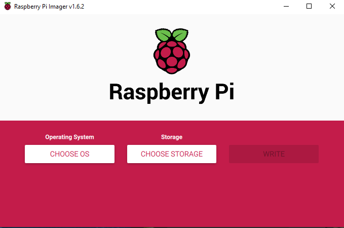
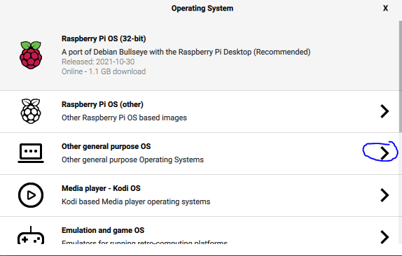
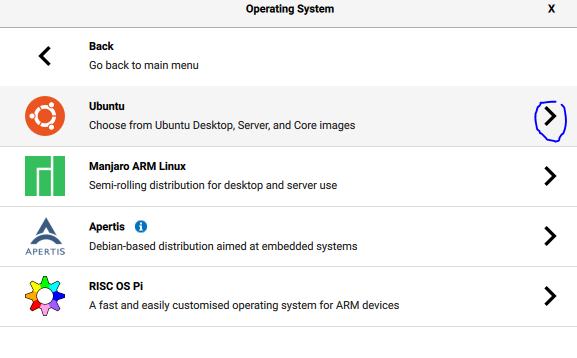
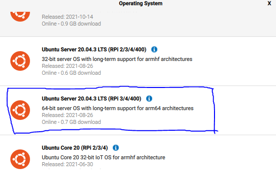
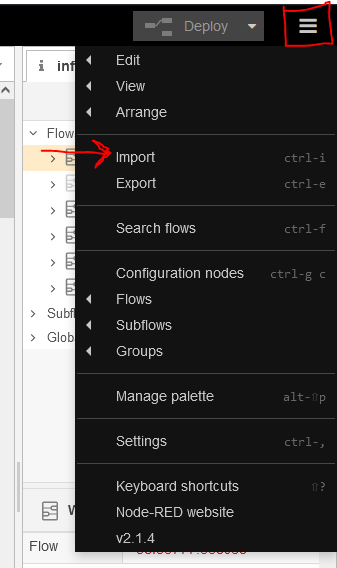
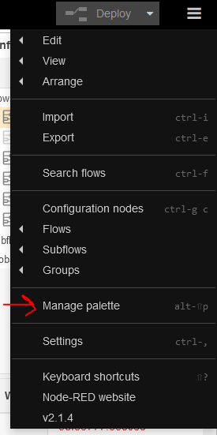

# FreeTAKServer-RaspberyPi-Install
Instructions for installing FreeTAKServer, FreeTAKServer-UI, FreeTAKHub on RaspberryPI Ubuntu.


# Raspberry Pi Setup

First you will need a Raspberry Pi. 
Preferably Raspberry Pi 3 or higher and at least a 16GB micro sd card.

Next you will need the [Raspberry Pi Imager Software](https://www.raspberrypi.com/software/).

Once that is installed, insert your micro sd into your computer and install Ubuntu from the Raspberry Pi Imager Software.

## Flash Operating System


Select Choose OS



Select General Purpose



Select Ubuntu



Select Ubuntu Server 20.04.3 LTS (64-Bit)

## Hook Up Raspberry Pi
Once the SD card has been flashed, plug the SD card into the Raspberry Pi and hook up the following connections:
 - Ethernet
 - Keyboard
 - HDMI to monitor
 - Power
# Ubuntu Setup

Default Login:
```
User: ubuntu
Pass: ubuntu
```

Once you have the Raspberry Pi booted up follow the prompts to change the default password.

Once you have changed the password update and upgrade the system.

```
sudo apt update && sudo apt upgrade -y
```

Restart if necessary.

## FreeTAK Server Setup

Install Python3 & Pip
```
sudo apt update && sudo apt install python3 && sudo apt install python3-pip
```
Next install python libraries

```
sudo apt install python3-dev python3-setuptools build-essential python3-gevent python3-lxml libcairo2-dev
```
```
sudo pip3 install wheel pycairo
```

Once you have the dependencies installed you can install FreeTAKServer

```
sudo python3 -m pip install FreeTAKServer[ui]
```

Verify the installation with
```
pip check FreeTakServer 
```

## Configure FTS

Type:
```
sudo python3 -m FreeTAKServer.controllers.services.FTS 
```

Also, if you do not want the welcome message everytime you connect to FTS, update ConnectionMessage in MainConfig.py file.

```
cd /usr/local/lib/python3.8/dist-packages/FreeTAKServer/controllers/configuration
```

```
sudo nano MainConfig.py
```

There will be 3 instances of this that you must update
You can search for them by pressing: `Ctl+w` then typing `ConnectionMessage` then press enter. 
After you update the first one repeat the process. Press `ctl+w` and then enter (you do not have to type in `ConnectionMessage` again)
```
ConnectionMessage = None
```


## FTS-UI Configuration
Navigate to the FTS-UI directory
```
cd /usr/local/lib/python3.8/dist-packages/FreeTAKServer-UI
```

Then edit:
```
sudo nano config.py
```

Edit the following values:

```
IP = 'Your IP'
```
```
APPIP = 'Your IP'
```
```
WEBMAPIP = 'Your IP'
```

Only change this value if you are using a Raspberry Pi

```
WEBMAPPORT = 1880
```

Then run:
```
cd && sudo pip3 install WTForms==2.3.3 
```

## Running FTS & FTS-UI

Setup FTS & FTS-UI as a service copy the following:

```
cd /etc/systemd/system
```

```
sudo nano FTS.service
```
Copy the following:
```
[Unit]
Description=FreeTAK Server service
After=network.target
StartLimitIntervalSec=0

[Service]
Type=simple
Restart=always
RestartSec=1
ExecStart=/usr/bin/python3 -m FreeTAKServer.controllers.services.FTS -DataPackageIP 0.0.0.0 -AutoStart True


[Install]
WantedBy=multi-user.target
```

Then do the same for FTS-UI
```
sudo nano FTS-UI.service
```
```
[Unit]
Description=FreeTAK Server UI service
After=network.target
StartLimitIntervalSec=0

[Service]
Type=simple
Restart=always
RestartSec=1
ExecStart=sudo python3 /usr/local/lib/python3.8/dist-packages/FreeTAKServer-UI/run.py

[Install]
WantedBy=multi-user.target
```
Once those are created run the following
```
sudo systemctl daemon-reload
```
This will reload the systemd service so you can start the FTS & FTS-UI service

&

```
sudo systemctl enable FTS.service && sudo systemctl enable FTS-UI.service
```
This will make FTS & FTS-UI start on server startup

Once you are ready to start both up run the following:

```
sudo service FTS start
```

```
sudo service FTS-UI start
```
## FreeTAK-Hub Setup

Next install Node-Red
```
bash <(curl -sL https://raw.githubusercontent.com/node-red/linux-installers/master/deb/update-nodejs-and-nodered)
```

Follow the prompts for the Raspberry Pi install

Then run 
```
sudo systemctl enable nodered.service
```

Once that completes start node-red
```
node-red-start
```

Navigate to the service:

```
http:<ip>:1880
```

Once you are on the page open a new tab and navigate to the [FreeTAKHub GitHub Repo](https://github.com/FreeTAKTeam/FreeTAKHub) and download the [flows.json](https://github.com/FreeTAKTeam/FreeTAKHub/blob/main/flows.json).

Next you will want to import the flows.json into node-red.



Select the flows.json and import into current flow.



Next you will have to install the following dependencies.
 - node-red-dashboard
 - node-red-contrib-zip
 - node-red-contrib-web-worldmap
 - node-red-contrib-telegrambot
 - node-red-contrib-multifeed-parser


Once those are installed go to `web Map 2`

Double click `FTS Server` and update the IP to your server IP

You can also configure the `TAK Map` by double clicking the `TAK Map` node.


Once everything is configured click deploy at the top right.


# Wireguard VPN

To add an extra layer of security to your server you can add a Wireguard VPN to allow encrypted tunnel access.

This guide will use PiVPN for it's ease of use and ability to quickly add clients.

## PiVPN Install

Use this command to quickly install PiVPN and follow the prompts
```
curl -L https://install.pivpn.io | bash
```

Once installed you will need to change a few things.

```
sudo nano /opt/pivpn/wireguard/makeCONF.sh
```

Change

This line:
```
AllowedIPS = "0.0.0.0/0, ::0/0" >> "configs/${CLIENT_NAME}.conf"
```

To
```
AllowedIPs = "${pivpnNET}/24" >> "configs/${CLIENT_NAME}.conf"
```

This will only forward ATAK/FTS traffic to the VPN. All other internet traffic will not be filtered.


Then to add clients use
```
pivpn -a
```


# UFW
Once Wireguard is installed and you setup clients you will have to modify a few settings with FTS, FTS-UI & your firewall.


Your FTS/FTS-UI Ip's will have to point to the default wg0 IP address and you will have to setup the firewall rules to allow wg0 to access the specific ports that FTS, FTS-UI, and node-red/webmap are utilizing.

First you must change the IP's that FTS, & FTS UI are pointing to.


FTS Configuration
```
sudo nano /opt/FTSConfig.yaml
```
Change the following lines
(`10.6.0.1` - is the default IP for Wireguard)
```
FTS_DP_ADDRESS=10.6.0.1
FTS_USER_ADDRESS=10.6.0.1
```

FTS-UI Configuration

```
sudo nano /usr/local/lib/python3.8/dist-packages/FreeTAKServer-UI/config.py
```

Change the following lines
(`10.6.0.1` - is the default IP for Wireguard)
```
IP = '10.6.0.1'
APPIP = '10.6.0.1'
WEBMAPIP = '10.6.0.1'
```

Now FTS & FTS UI should be running on the Wireguard IP.

Nex you will have to update the firewall to allow your Wireguard IP's to access FTS

UFW should be installed already, but you can install it with:
```
sudo apt install ufw
```

Then you will need to add the following rules:

Port 51820 is the default Wireguard port. Change this if you configured your wireguard differently
```
sudo ufw allow 51820
```

This is the default ssh port. If you do not allow this port access you will not be able to ssh into your server. Also, if you changed your ssh port, update this value.
```
sudo ufw allow 22
```

The next set of rules will be for allowing clients on the wg0 interface to access all the services that FTS, FTS-UI, and FTS-Hub/Webmap uses.


FTS-UI
```
sudo ufw allow in on wg0 to any port 5000
```

TCP connections
```
sudo ufw allow in on wg0 to any port 8087
```

SSL connections
```
sudo ufw allow in on wg0 to any port 8089
```

Certificate Enrollment API Port
```
sudo ufw allow in on wg0 to any port 8446
```

COT Data
```
sudo ufw allow in on wg0 to any port 19023
```

Insecure Server API Port
```
sudo ufw allow in on wg0 to any port 8000
```
Secure Server API Port
```
sudo ufw allow in on wg0 to any port 8443
```

NodeRed
```
sudo ufw allow in on wg0 to any port 1880
```

You can further restrict the access to specific ports by specifying which IP's can access the port. Instead of allowing full access from the wg0 port

Ex:
```
sudo ufw allow in on wg0 to any port 8087 from 10.6.0.4
```

Once you have all the rules set type:
```
sudo ufw enable
```


Fail2Ban is also reccommended. 
